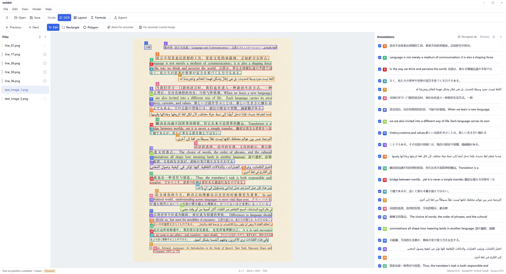

# oarlabel

Desktop annotation tool for OCR, document layout, and formula recognition.

Built with [Tauri](https://github.com/tauri-apps/tauri),
[React](https://github.com/facebook/react), and
[oar-ocr](https://github.com/GreatV/oar-ocr).

<p align="center">
  
</p>

## Features

- OCR, layout detection, and formula annotation modes
- Detection/recognition exports for OCR and COCO export for layout annotations
- Manual box editing with rectangle and polygon tools
- AI pre-annotation for the current image or a batch of images
- Per-image JSON annotation files
- PPOCRLabel-compatible dataset export

## Development

Prerequisites: Node.js, Rust, and the Tauri v2 system dependencies.

```bash
npm install
npm run tauri dev
```

## License

Apache-2.0
